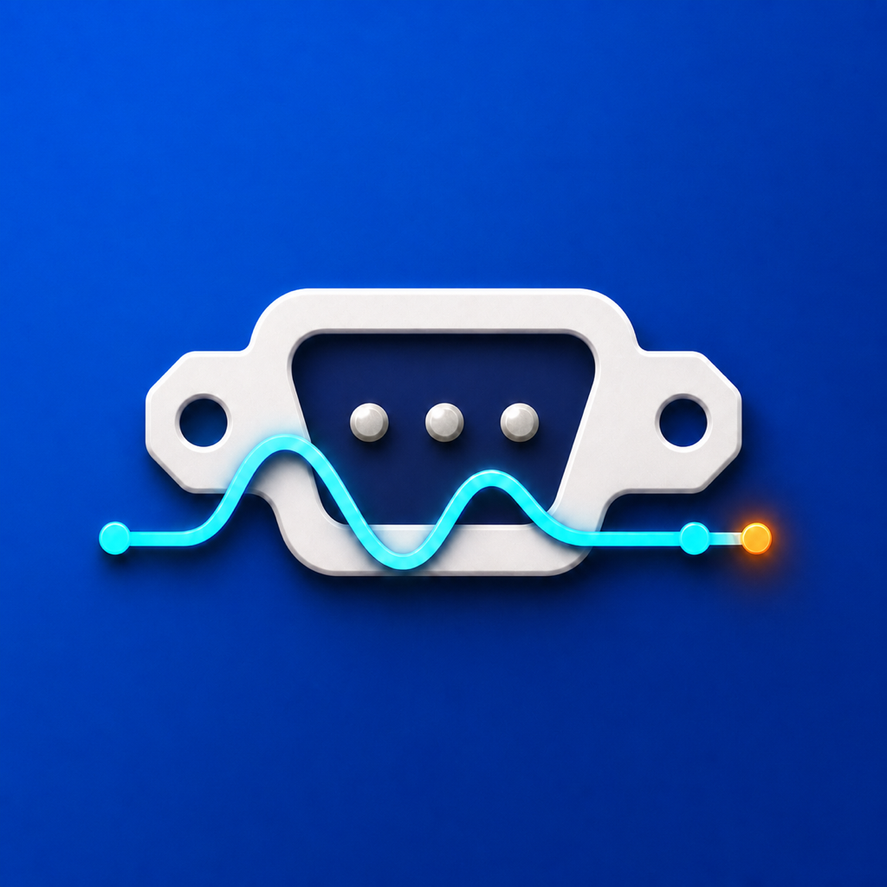
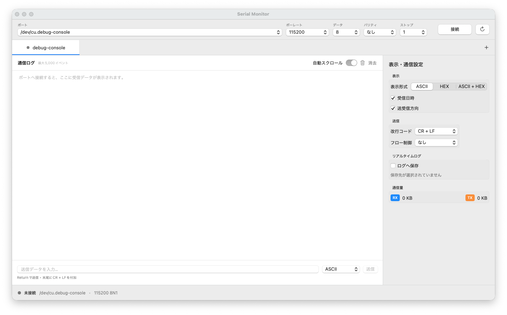

# Serial Monitor for macOS

<p align="center">
  
</p>

A lightweight native macOS serial terminal for Arduino boards, microcontrollers, and other serial devices. It provides a practical GUI alternative to command-line tools such as `screen`, while keeping all communication local to your Mac.



> The current application UI uses Japanese labels. This README is maintained in English.

## Features

- Automatic discovery and refresh of `/dev/cu.*` serial ports
- Baud rate, data bits, parity, stop bits, and flow-control settings
- LF, CR, CR+LF, or no line ending for ASCII transmission
- ASCII, hexadecimal, and combined ASCII + HEX display modes
- ASCII and hexadecimal input modes
- Optional receive timestamps and RX/TX direction markers
- Real-time log recording to a user-selected file
- Multiple simultaneous serial connections in separate tabs
- Per-tab connection and display settings
- RX/TX byte counters, automatic scrolling, and log clearing
- Batched UI updates for responsive high-frequency input
- Native SwiftUI interface with an AppKit-backed terminal view

## Requirements

- macOS 13 Ventura or later
- Xcode 16 or later with a Swift 6 toolchain
- A USB serial device and any driver required by that device

### Verified development environment

| Component | Version |
| --- | --- |
| macOS | 26.3 |
| Architecture | Apple Silicon (`arm64`) |
| Xcode | 26.6 |
| Swift | 6.3.3 |

The source is written against standard macOS frameworks and POSIX APIs. Intel builds have not yet been tested.

## Getting started with Xcode

1. Clone the repository:

   ```sh
   git clone https://github.com/taltalp/mac-serialport.git
   cd mac-serialport
   ```

2. Open `Package.swift` in Xcode.
3. Select the `SerialMonitor` scheme and **My Mac** as the run destination.
4. Press **Run** or use <kbd>Command</kbd>+<kbd>R</kbd>.

No third-party packages are required.

## Command-line development

If the active developer directory still points to Command Line Tools, specify the Xcode toolchain explicitly:

```sh
export DEVELOPER_DIR=/Applications/Xcode.app/Contents/Developer
```

Run the tests and launch a development build:

```sh
swift test --disable-sandbox
swift run --disable-sandbox SerialMonitor
```

## Building a standalone app

Run the included packaging script:

```sh
./scripts/build-app.sh
```

The app is generated at:

```text
.build/Serial Monitor.app
```

The generated bundle is ad-hoc signed for local development and includes the serial-device and user-selected-file entitlements. Developer ID or Mac App Store distribution requires a signing team and provisioning configuration in Xcode.

## Usage

### Connect to a device

1. Connect an Arduino, microcontroller, or USB serial adapter to your Mac.
2. Select its `/dev/cu.*` path from the **Port** menu.
3. Choose the baud rate and serial format required by the device.
4. Click **Connect**.
5. Incoming data appears in the central communication log.

Use the refresh button if a newly attached device does not appear immediately.

### Send ASCII data

1. Select **ASCII** next to the send field.
2. Choose the required line ending in the right-side settings panel.
3. Enter a command and press Return or click **Send**.

The selected line ending is appended automatically.

### Send hexadecimal data

1. Select **HEX** next to the send field.
2. Enter space- or comma-separated bytes, for example:

   ```text
   7E 00 FF 0D 0A
   ```

   `0x7E` notation is also accepted.

3. Click **Send**.

Line endings are not appended automatically in HEX mode, so include the required bytes explicitly.

### Record a real-time log

1. Enable **Save to log** in the right-side panel.
2. Choose a destination file.
3. Continue communicating normally.

Each saved entry includes a timestamp, direction, printable representation, and exact hexadecimal bytes. File logging continues independently of the on-screen 5,000-event limit.

### Open multiple ports

Click the **+** button in the tab bar to create another session. Each tab owns an independent serial connection, log buffer, display mode, and log file.

## Supported serial settings

| Setting | Supported values |
| --- | --- |
| Baud rate | 300 to 230400 using the presets in the UI |
| Data bits | 5, 6, 7, 8 |
| Parity | None, even, odd |
| Stop bits | 1, 2 |
| Flow control | None, RTS/CTS, XON/XOFF |
| ASCII line ending | None, LF, CR, CR+LF |

## Project structure

| Path | Purpose |
| --- | --- |
| `Sources/SerialCore` | POSIX `termios` transport, port discovery, data formatting, and real-time file logging |
| `Sources/SerialMonitor` | SwiftUI application, tab sessions, settings panels, and AppKit terminal view |
| `Tests/SerialCoreTests` | Data conversion, port discovery, logging, and pseudo-terminal integration tests |
| `Packaging` | App metadata and App Sandbox entitlements |
| `scripts/build-app.sh` | Local release build and `.app` packaging |
| `docs/images` | README screenshots |

## Testing

The test suite includes real read/write integration tests using a macOS pseudo-terminal, so the serial transport is exercised without physical hardware.

```sh
export DEVELOPER_DIR=/Applications/Xcode.app/Contents/Developer
swift test --disable-sandbox
```

The current suite contains nine tests covering:

- ASCII and hexadecimal input conversion
- Line-ending behavior
- ASCII and HEX display formatting
- `/dev/cu.*` port filtering
- Real-time log persistence
- Bidirectional pseudo-terminal communication

## Troubleshooting

### The serial port does not appear

- Disconnect and reconnect the device, then click the refresh button.
- Check whether the device appears as `/dev/cu.*` in Terminal.
- Install the vendor driver if your USB serial adapter requires one.
- Try a different USB cable; some cables provide power only.

### The port is busy

Only one process can normally open a serial port at a time. Close Arduino Serial Monitor, `screen`, or another terminal application before connecting.

### Command-line builds use the wrong SDK

Set the Xcode developer directory for the current shell:

```sh
export DEVELOPER_DIR=/Applications/Xcode.app/Contents/Developer
```

## Current limitations

- The application UI is currently Japanese only.
- Custom baud rates outside the presets are not yet supported.
- Physical Arduino hardware has not yet been included in the automated test suite.
- The project currently targets macOS only.
